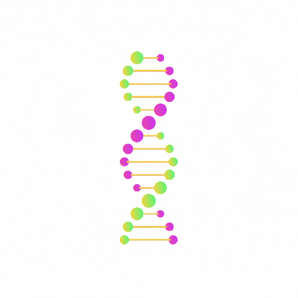
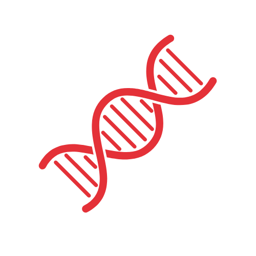

#  DNA-Sequence-Classifier 
---
[](https://github.com/kanishksh4rma/DNA-Sequence-Classifier )
[](https://github.com/kanishksh4rma/DNA-Sequence-Classifier )
<!-- PROJECT LOGO -->
<br />
<p align="center">
  <a href="https://github.com/kanishksh4rma/Brain_Tumour_detection_using_MRI_Scans">
    
  </a>
  <!-- INTRODUCTION -->

<!-- ABOUT THE PROJECT -->
## About The Project

<a href="https://github.com/kanishksh4rma/Brain_Tumour_detection_using_MRI_Scans">
    
  </a>

DNA, abbreviation of deoxyribonucleic acid, organic chemical of complex molecular structure that is found in all prokaryotic and eukaryotic cells and in many viruses. DNA codes genetic information for the transmission of inherited traits. Every species has a specific genes encoded in their DNA.

In this project, I have designed and developed a machine learning model for DNA sequence classification based on spectral sequence representation. 

---

### Libraries used : 

```

  * keras
  * Tensorflow
  * sklearn
  * pandas
  * numpy
  
```
---

## Algorithms Used

> * VGG16 (Transfer Learning in Deep Learning)

---
## Directory Structure

```sh
├── DNA Sequencing and applying Classifier.ipynb
├── dna_sequencing_and_applying_classifier.py
├── dog_data.txt
├── human_data.txt
├── LICENSE
├── README.md
└── requirements.txt
```
<!-- GETTING STARTED -->
## Getting Started

This is an example of how you may set up your project locally.
To get a local copy up and running follow these simple steps.

### Prerequisites

Create a virtualenv. (optional)
  ```sh
  python3 -m venv DNA-Clf
  source DNA-Clf/bin/activate
  ```

### Installation

1. Clone the repo
   ```sh
   git clone https://github.com/kanishksh4rma/DNA-Sequence-Classifier.git
   ```
2. Install required libraries
   ```sh
   pip install -r requirements.txt
   ```
   
<!-- USAGE EXAMPLES -->
## Usage

Now run the app.py file by typing following command 
```sh
   python app.py
   ```
_For more examples, please refer to the [Documentation](#)_


## About Contribution :
* Raise the `issue` .
* Work on raised issues .
* Come up with interesting Medical related problems and solutions .
* You can improve the UI/UX .
* Can contribute on readme files as well .

## Package Guidelines

See [CONTRIBUTING.md](CONTRIBUTING.md) file for detailed information.

## License

See [LICENSE](LICENSE) file.


                                      "Take stands, take risks, take responsibility."
                                                                    — Muriel Siebert

---

[](https://github.com/kanishksh4rma/DNA-Sequence-Classifier)

